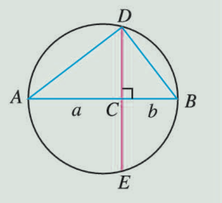

# fundamental inequality

## example

> In picture 2.2-1, AB is the circle's diameter, set point C on AB, AC=a, BC=b, Draw a chord DE perpendicular to AB through point C, and connect AD, BD.



In picture 2.2-1, we could learn ```triangle ACD```is similar to ```triangle DCB``` so that CD = sqrt(ab). But CD is < or = circle's radius, so we can use fundamental inequality to stand for the  picture.

## issue

> Why CD could equal to sqrt(ab)?

```
we can learn AC:CD = CD:CB (because triangle ACD is similar to triangle DCB)
so CD^2 = AC * CB = ab
so CD = sqrt(ab)
```

